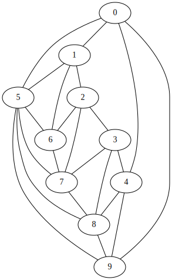

# Computational Topology

## Playing around with graphs

Magically going from a pure topological structure to a 2D straight line
embedding. Start with

```cpp
const size_t inner = 5;
const size_t outer = 5;
topo::PlanarGraph G(inner, outer);

// Add a bunch of edges.
G.AddEdge(0, 1);  G.AddEdge(1, 2);  G.AddEdge(2, 6);  G.AddEdge(3, 8);
G.AddEdge(0, 4);  G.AddEdge(1, 5);  G.AddEdge(2, 7);  G.AddEdge(4, 8);
G.AddEdge(0, 5);  G.AddEdge(1, 6);  G.AddEdge(3, 4);  G.AddEdge(4, 9);
G.AddEdge(0, 9);  G.AddEdge(2, 3);  G.AddEdge(3, 7);  ...
```

which according to graphviz's could look like:




Now, we can come up with a function `f: V -> R^2` that gives us the following
amazing drawing:


## Playing around with surfaces

...
